# 09. Kubernetes

# Homework Assignment 1: KinD Kubernetes Cluster Setup

1. Install Docker and KinD on your local machine.
```bush
# Add Docker's official GPG key:
sudo apt-get update
sudo apt-get install ca-certificates curl
sudo install -m 0755 -d /etc/apt/keyrings
sudo curl -fsSL https://download.docker.com/linux/ubuntu/gpg -o /etc/apt/keyrings/docker.asc
sudo chmod a+r /etc/apt/keyrings/docker.asc

# Add the repository to Apt sources:
echo \
  "deb [arch=$(dpkg --print-architecture) signed-by=/etc/apt/keyrings/docker.asc] https://download.docker.com/linux/ubuntu \
  $(. /etc/os-release && echo "$VERSION_CODENAME") stable" | \
  sudo tee /etc/apt/sources.list.d/docker.list > /dev/null
sudo apt-get update

# install the latest version Docker, run:
sudo apt-get install docker-ce docker-ce-cli containerd.io docker-buildx-plugin docker-compose-plugin

apt install apparmor -y

```


* KinD
```bush
# For AMD64 / x86_64
[ $(uname -m) = x86_64 ] && curl -Lo ./kind https://kind.sigs.k8s.io/dl/v0.24.0/kind-linux-amd64
chmod +x ./kind
sudo mv ./kind /usr/local/bin/kind
```
2. Create a KinD cluster with a single control plane node.

```bsuh
kind create cluster --name burlyaev
```

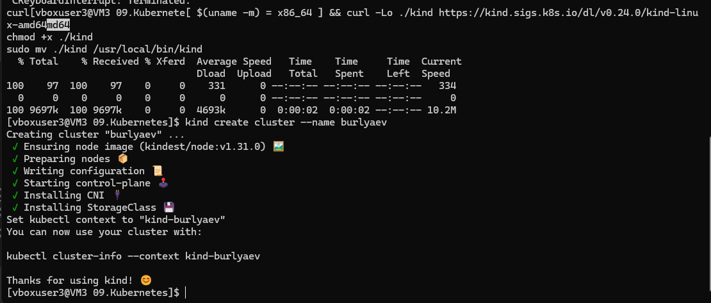

3. Verify that the cluster is up and running using kubectl.

```bush

  curl -LO "https://dl.k8s.io/release/$(curl -L -s https://dl.k8s.io/release/stable.txt)/bin/linux/amd64/kubectl"
  
  curl -LO "https://dl.k8s.io/release/$(curl -L -s https://dl.k8s.io/release/stable.txt)/bin/linux/amd64/kubectl.sha256"
  
  echo "$(cat kubectl.sha256)  kubectl" | sha256sum --check
  
  install -o root -g root -m 0755 kubectl /usr/local/bin/kubectl
 
  kubectl cluster-info --context kind-burlyaev
 ``` 

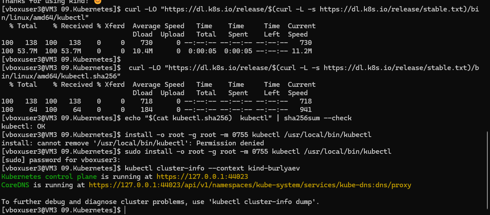

# Homework Assignment 2: Minikube Kubernetes Cluster Setup

1. Install Minikube and a hypervisor (e.g., VirtualBox/Docker) on your local machine.
```bush
  sudo curl -LO https://storage.googleapis.com/minikube/releases/latest/minikube-linux-amd64
  sudo install minikube-linux-amd64 /usr/local/bin/minikube && rm minikube-linux-amd64
```
2. Start a Minikube cluster with a single node.
```bush
  minikube start
```
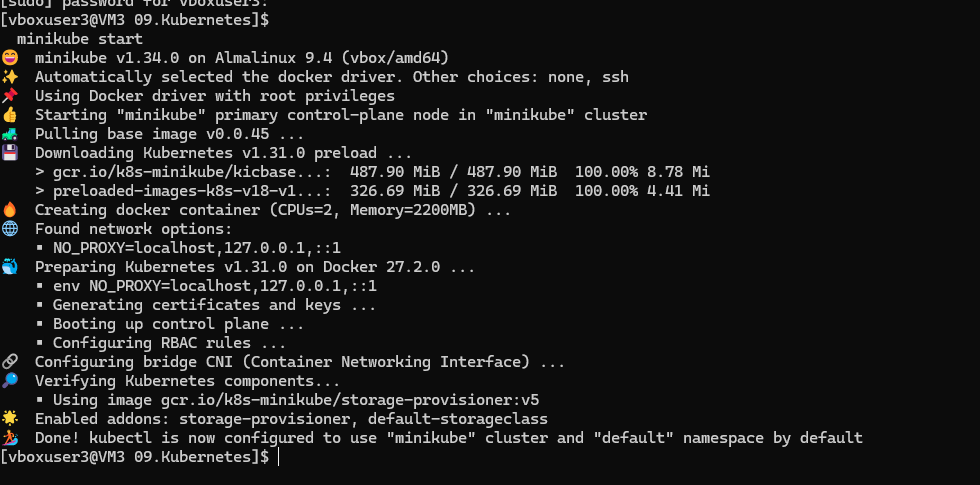

3. Confirm that the cluster is operational using kubectl.

```bush
kubectl get pods -A
NAMESPACE     NAME                               READY   STATUS    RESTARTS        AGE

kube-system   coredns-6f6b679f8f-gdd86           1/1     Running   0               8m37s
kube-system   etcd-minikube                      1/1     Running   0               8m42s
kube-system   kube-apiserver-minikube            1/1     Running   0               8m42s
kube-system   kube-controller-manager-minikube   1/1     Running   0               8m42s
kube-system   kube-proxy-mcwgx                   1/1     Running   0               8m37s
kube-system   kube-scheduler-minikube            1/1     Running   0               8m42s
kube-system   storage-provisioner                1/1     Running   1 (7m57s ago)   8m40s
```
```bush
minikube addons list 
minikube addons enable dashboard 
```
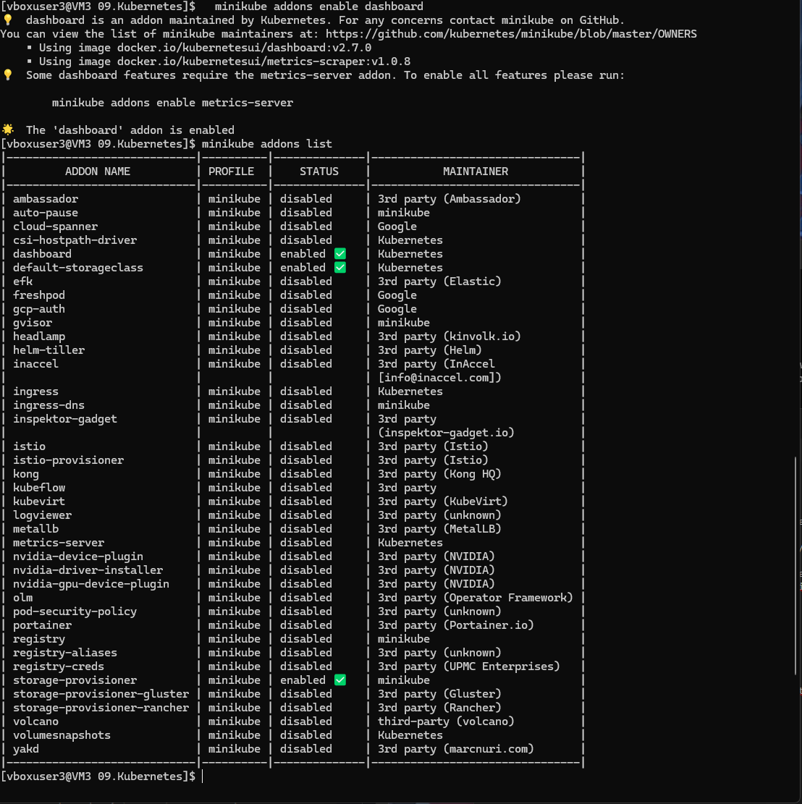

```bush 
kubectl proxy --address='0.0.0.0' --disable-filter=true & ssh -L 8001:127.0.0.1:8001 vboxuser3@192.168.63.4 -N -f
```
```bush
page http://192.168.63.4:8001/
```
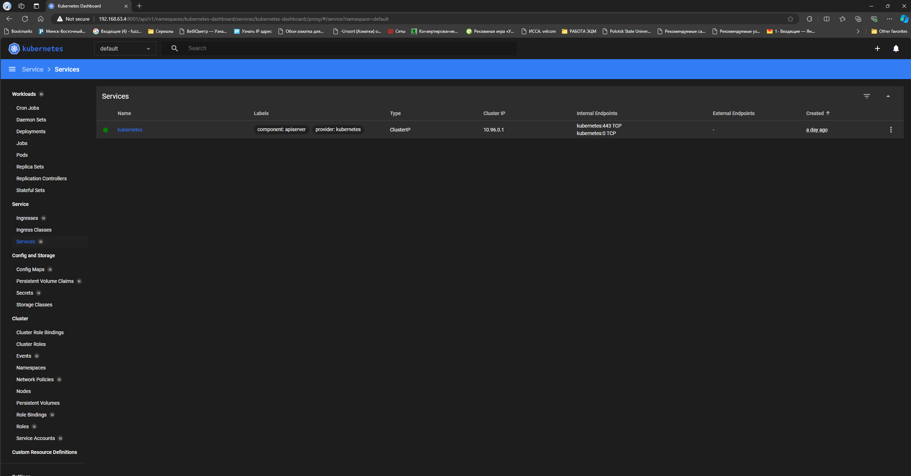

3 Homework Assignment 3: GitHub Actions for KinD Cluster Setup

1. Create a GitHub repository for your Kubernetes-related assignments.
```bush
https://github.com/dmitry-kitsune/09.Kubernetes
```
2. Write a GitHub Actions workflow that sets up a KinD cluster.
```bush
name: Setup KinD Cluster

on:
  push:
    branches:
      - main
  pull_request:
    branches:
      - main
  workflow_dispatch:

jobs:
  setup-kind-cluster:
    runs-on: ubuntu-latest

    steps:
      # Step 1: Checkout the repository
      - name: Checkout the repository
        uses: actions/checkout@v3

      # Step 2: Install KinD (Kubernetes in Docker)
      - name: Install KinD
        run: |
          curl -Lo ./kind https://kind.sigs.k8s.io/dl/v0.20.0/kind-linux-amd64
          chmod +x ./kind
          sudo mv ./kind /usr/local/bin/kind

      # Step 3: Install kubectl (Kubernetes CLI)
      - name: Install kubectl
        run: |
          curl -LO "https://dl.k8s.io/release/$(curl -L -s https://dl.k8s.io/release/stable.txt)/bin/linux/amd64/kubectl"
          chmod +x ./kubectl
          sudo mv ./kubectl /usr/local/bin/kubectl

      # Step 4: Create KinD cluster named "burlyaev-cluster"
      - name: Create KinD cluster
        run: |
          kind create cluster --name burlyaev-cluster --wait 5m
      
      # Step 5: Verify kubectl connection to the KinD cluster
      - name: Get cluster info
        run: kubectl cluster-info

      # Step 6: Get Kubernetes version info
      - name: Get Kubernetes version
        run: kubectl version --output=json

      # Step 7: Get nodes information in the cluster
      - name: Get nodes info
        run: kubectl get nodes -o wide

      # Step 8: Describe all the nodes in the cluster for detailed info
      - name: Describe nodes
        run: kubectl describe nodes

      # Step 9: Get all running pods in the default namespace
      - name: Get running pods
        run: kubectl get pods --all-namespaces

      # Step 10: Check for available namespaces
      - name: List namespaces
        run: kubectl get namespaces
```
3. Configure the workflow to run on every push to a specific branch.
```bush
name: Setup KinD Cluster

on:
  push:
    branches:
      - main
  pull_request:
    branches:
      - main
  workflow_dispatch:
```
4. Use a Docker container or GitHub-hosted runner for the workflow execution.

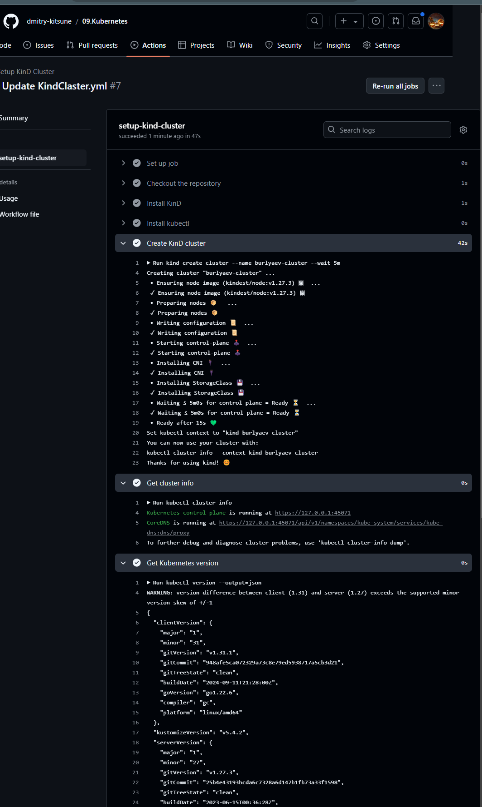

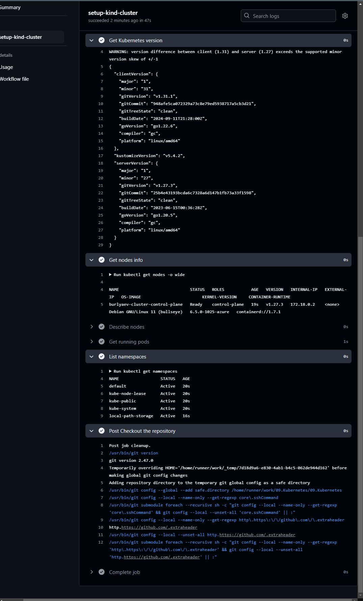


# Homework Assignment 4: GitHub Actions for Minikube Cluster Setup

1. Enhance the existing GitHub repository with another Actions workflow.

```bush
https://github.com/dmitry-kitsune/09.Kubernetes
```
2. This time, create a workflow that sets up a Minikube cluster.
```bush
.github/workflows/MinikubeClaster.yaml

name: Setup Minikube Cluster

on:
  push:
    branches:
      - main
  pull_request:
    branches:
      - main
  workflow_dispatch:

jobs:
  setup-minikube-cluster:
    runs-on: ubuntu-latest

    steps:
      # Step 1: Checkout the repository
      - name: Checkout repository
        uses: actions/checkout@v3

      # Step 2: Install Minikube
      - name: Install Minikube
        run: |
          curl -LO https://storage.googleapis.com/minikube/releases/latest/minikube-linux-amd64
          chmod +x minikube-linux-amd64
          sudo install minikube-linux-amd64 /usr/local/bin/minikube

      # Step 3: Install kubectl (Kubernetes CLI)
      - name: Install kubectl
        run: |
          curl -LO "https://dl.k8s.io/release/$(curl -L -s https://dl.k8s.io/release/stable.txt)/bin/linux/amd64/kubectl"
          chmod +x kubectl
          sudo mv kubectl /usr/local/bin/kubectl

      # Step 4: Start Minikube with Docker driver
      - name: Start Minikube
        run: |
          minikube start --driver=docker --wait=true
          minikube status

      # Step 5: Verify kubectl connection to Minikube cluster
      - name: Get cluster info
        run: kubectl cluster-info

      # Step 6: Get Kubernetes version info
      - name: Get Kubernetes version
        run: kubectl version --output=json

      # Step 7: Get nodes information in the cluster
      - name: Get nodes info
        run: kubectl get nodes -o wide

      # Step 8: Describe all the nodes in the cluster for detailed info
      - name: Describe nodes
        run: kubectl describe nodes

      # Step 9: Get all running pods in the default namespace
      - name: Get running pods
        run: kubectl get pods --all-namespaces

      # Step 10: List available namespaces
      - name: List namespaces
        run: kubectl get namespaces
```
3. Configure the workflow to run on pull requests to the repository.
```bush
on:
  push:
    branches:
      - main
  pull_request:
    branches:
      - main
  workflow_dispatch:
```
4. Utilize appropriate GitHub Actions features to customize the workflow execution environment.


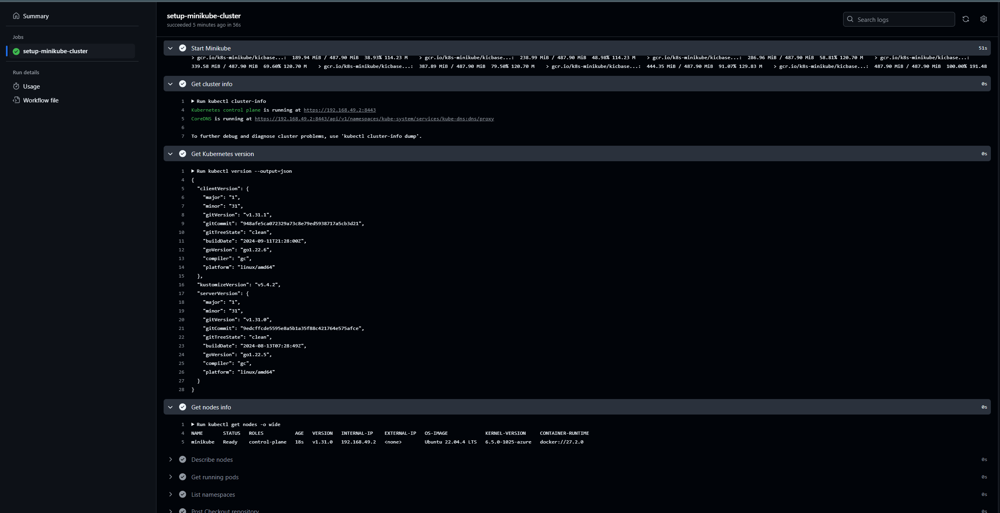


Please check in the last two assignments:

1. how many nodes they have


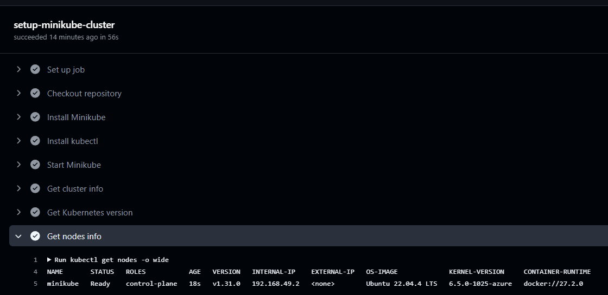

	*By default, KinD sets up a single node.
	*Minikube also creates a single-node, by default

	*one node each

2. which latest version of Kubernetes they are using
```bush 
	*Minikube Cluster: use Kubernetes v1.31.0 (clientVersion/serverVersion) - nodes.
	*the KinD Cluster: use Kubernetes v1.27.3 (serverVersion) - nodes.
```
3. how long they spin up (you can provide just timing)

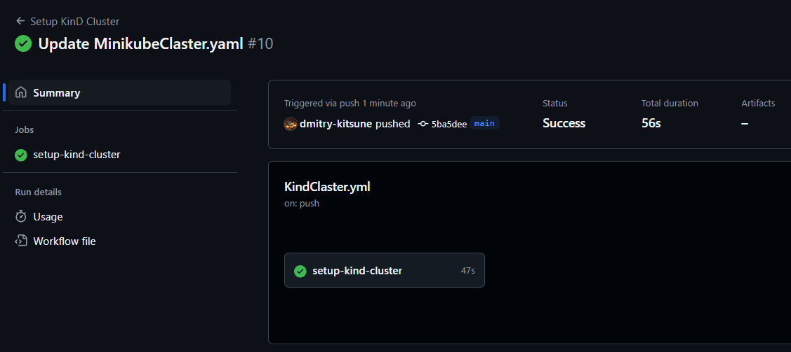
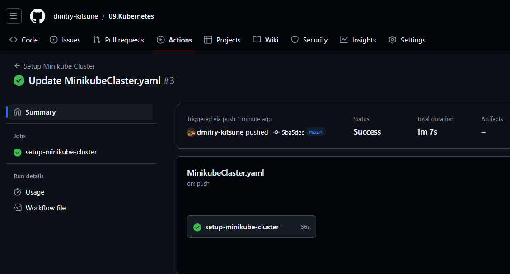

History of your commands and github-action file(s) add into folder 09.Kubernetes and prepare PR (Pull Request)