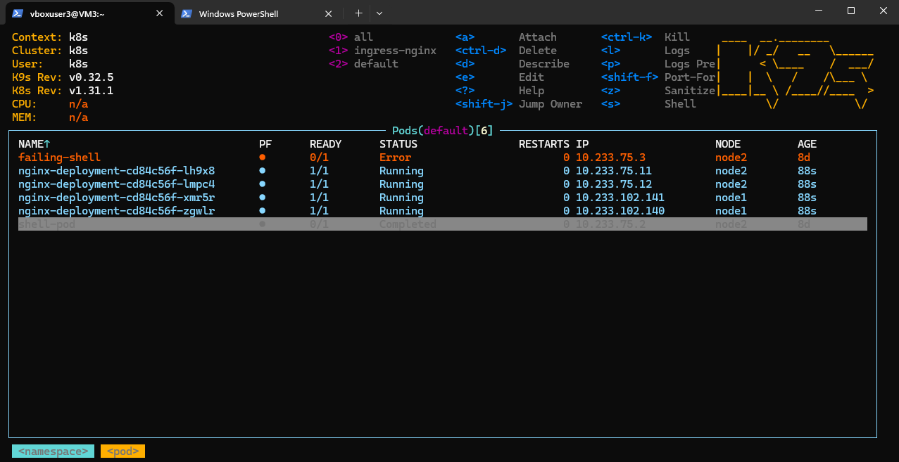
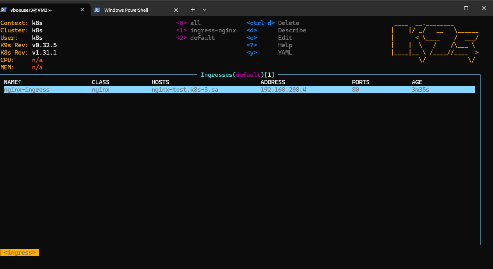
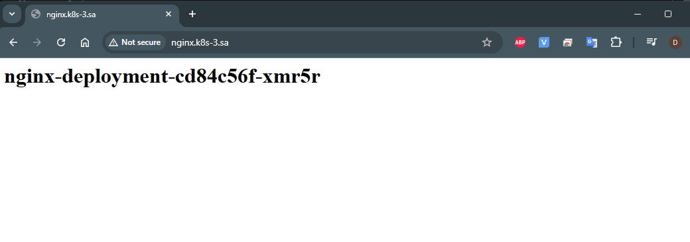
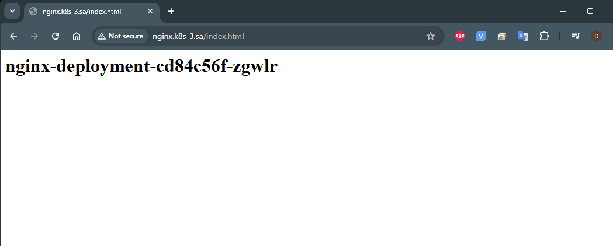
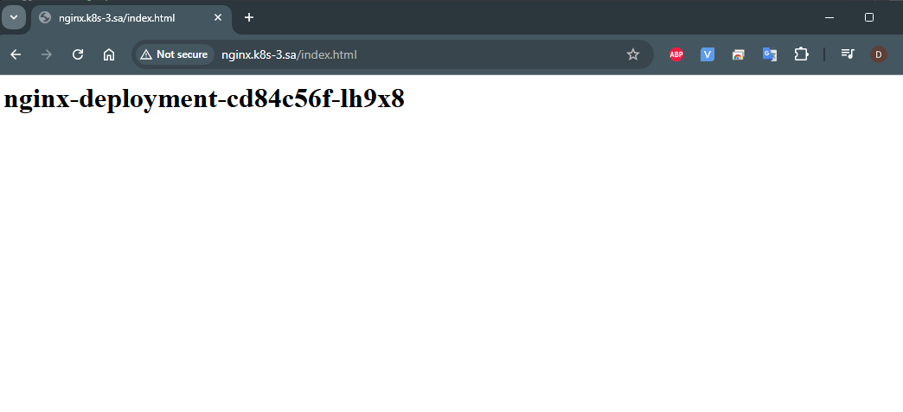
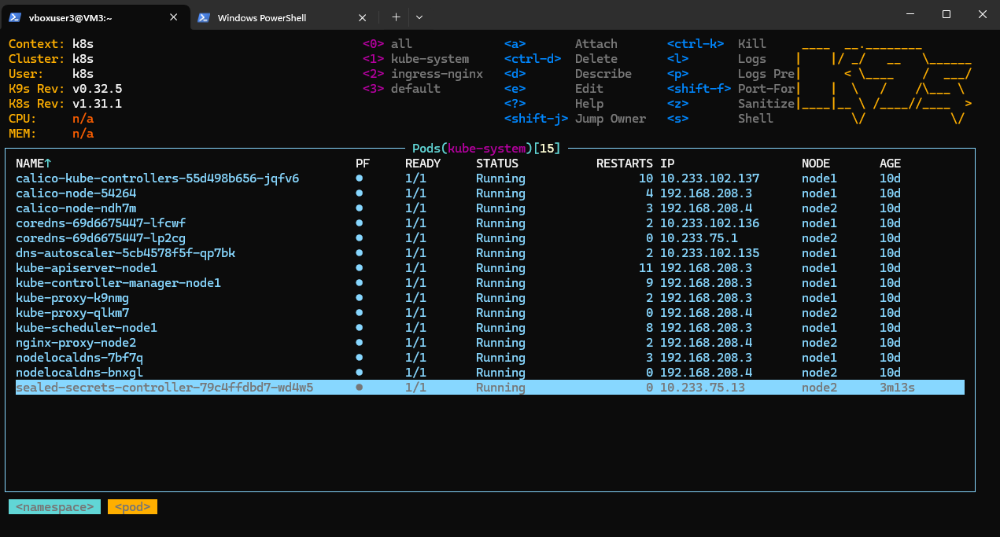
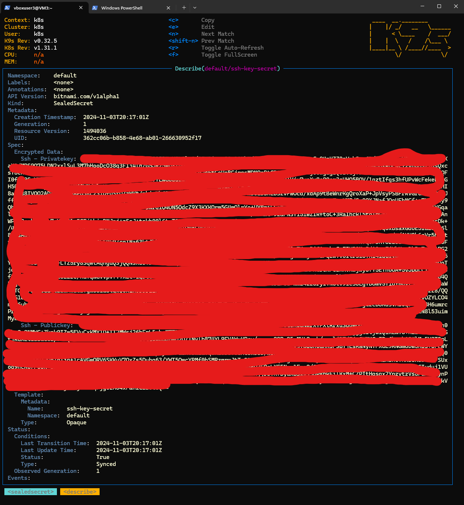
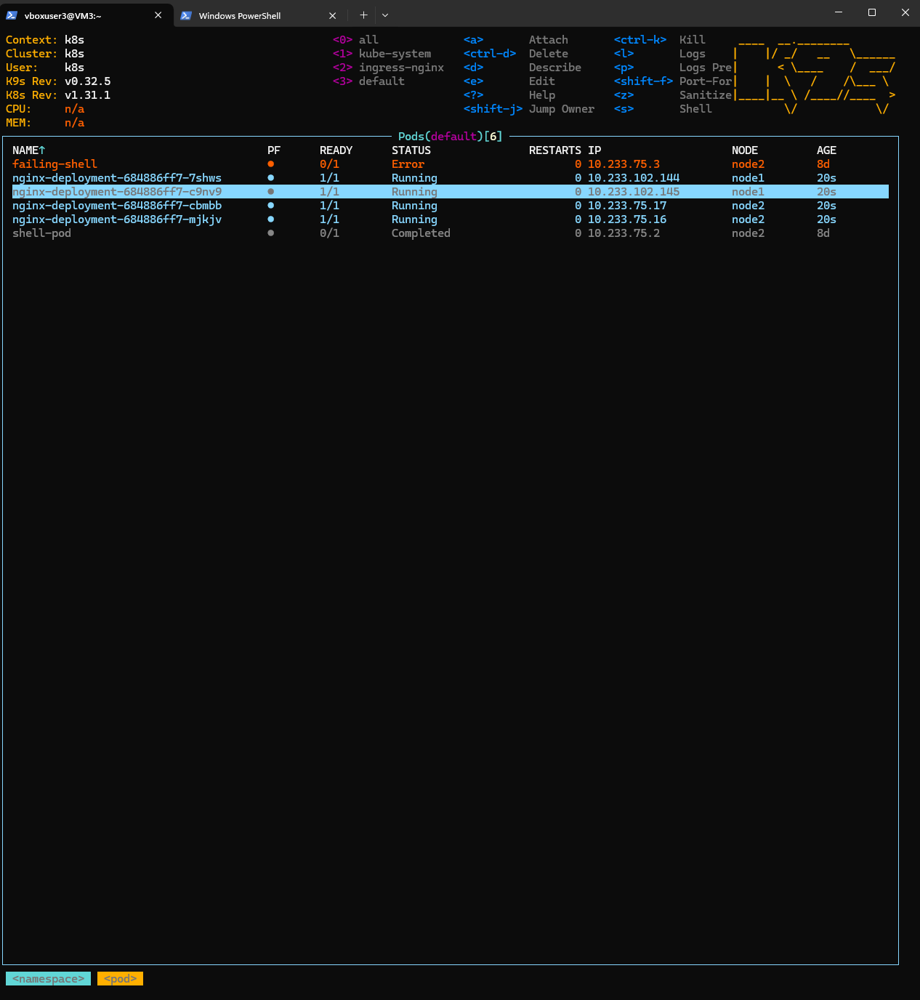
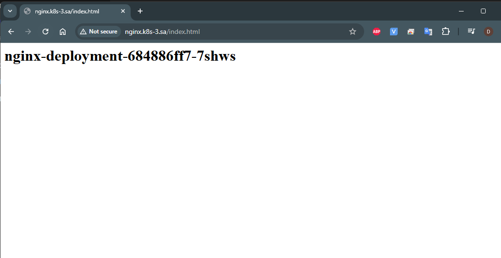

12. Kubernetes. Data. Security

# Homework Assignment 1. Config maps and secrets

    You need to improve deployment from previous task:

```bush
#  nginx-deployment.yaml
apiVersion: apps/v1
kind: Deployment
metadata:
  name: nginx-deployment
  labels:
    app: nginx
spec:
  replicas: 4
  selector:
    matchLabels:
      app: nginx
  strategy:
    type: RollingUpdate
    rollingUpdate:
      maxUnavailable: 1     # Ensure zero downtime during updates
      maxSurge: 2           # Allow one extra pod during updates
  template:
    metadata:
      labels:
        app: nginx
    spec:
      containers:
      - name: nginx
        image: nginx:latest
        ports:
        - containerPort: 80
        resources:
          requests:
            cpu: "100m"
            memory: "100Mi"
          limits:
            cpu: "200m"
            memory: "200Mi"
---
apiVersion: v1
kind: Service
metadata:
  name: nginx-service
  labels:
     run: nginx-service
spec:
  type: LoadBalancer
  ports:
  - port: 80
    protocol: TCP
    targetPort: 80
  selector:
    app: nginx
---
apiVersion: networking.k8s.io/v1
kind: Ingress
metadata:
  name: nginx-ingress
  annotations:
    nginx.ingress.kubernetes.io/server-alias: "nginx.k8s-3.sa"
spec:
  ingressClassName: nginx
  rules:
    - host: nginx-test.k8s-3.sa
      http:
        paths:
          - path: /
            pathType: Prefix
            backend:
              service:
                name: nginx-service
                port:
                  number: 80
```
```bush

    - Add index.php page as config map, which should display hostname of pod as first level header, or generate index.html inside init container
 
---
apiVersion: apps/v1
kind: Deployment
metadata:
  name: nginx-deployment
    type: RollingUpdate
    rollingUpdate:
      maxUnavailable: 1
      maxSurge: 2
  template:
    metadata:
      labels:
        app: nginx
    spec:
      # Init container to generate index.html
      initContainers:
      - name: init-index
        image: busybox
        command: ["sh", "-c"]
        args:
          - echo "<h1>$(hostname)</h1>" > /usr/share/nginx/html/index.html;
        volumeMounts:
        - name: web-content
          mountPath: /usr/share/nginx/html/

      containers:
      - name: nginx
        image: nginx:latest
        ports:
        - containerPort: 80
        resources:
          requests:
            cpu: "100m"
            memory: "100Mi"
          limits:
            cpu: "200m"
            memory: "200Mi"
        volumeMounts:
        - name: web-content
          mountPath: /usr/share/nginx/html/   # Mount for generated index.html
      volumes:
      - name: web-content
        emptyDir: {}  # Temporary storage to share data between init container and main container
---
```








    - generate pair public and private keys (or use existing) and add them to the pod for user root as secrets, please use sealsecret object for that

```bush

wget https://github.com/bitnami-labs/sealed-secrets/releases/download/v0.27.1/kubeseal-0.27.1-linux-amd64.tar.gz
sudo tar -C /usr/local/bin -xzf kubeseal-0.27.1-linux-amd64.tar.gz
kubectl apply -f https://github.com/bitnami-labs/sealed-secrets/releases/download/v0.27.1/controller.yaml
ssh-keygen -b 2048 -t rsa

# Generate the Secret
cat ~/.ssh/id_rsa
cat ~/.ssh/id_rsa.pub

echo "<contents of id_rsa>" > id_rsa_temp
cat id_rsa_temp | base64

echo "<contents of id_rsa.pub>" > id_rsa.pub_temp
cat id_rsa.pub_temp | base64 

nano ssh-key-secret.yaml 
# ssh-key-secret.yaml 
apiVersion: v1
kind: Secret
metadata:
  name: ssh-key-secret
  namespace: default
type: Opaque
data:
  ssh-privatekey: <base64-encoded-private-key>
  ssh-publickey: <base64-encoded-public-key>
```

```bush

# SealedSecret.yaml
---
apiVersion: bitnami.com/v1alpha1
kind: SealedSecret
metadata:
  creationTimestamp: null
  name: ssh-key-secret
  namespace: default
spec:
  encryptedData:
    ssh-privatekey: <encrypted-private-key>  #private key
    ssh-publickey: <encrypted-public-key>   #public key
  template:
    metadata:
      creationTimestamp: null
      name: ssh-key-secret
      namespace: default
    type: Opaque
```
``` bush
# nginx-deployment.yaml

---
apiVersion: apps/v1
kind: Deployment
metadata:
  name: nginx-deployment
  labels:
    app: nginx
spec:
  replicas: 4
  selector:
    matchLabels:
      app: nginx
  strategy:
    type: RollingUpdate
    rollingUpdate:
      maxUnavailable: 1
      maxSurge: 2
  template:
    metadata:
      labels:
        app: nginx
    spec:
      # Init container to generate index.html
      initContainers:
      - name: init-index
        image: busybox
        command: ["sh", "-c"]
        args:
          - echo "<h1>$(hostname)</h1>" > /usr/share/nginx/html/index.html;
        volumeMounts:
        - name: web-content
          mountPath: /usr/share/nginx/html/

      containers:
      - name: nginx
        image: nginx:latest
        ports:
        - containerPort: 80
        resources:
          requests:
            cpu: "100m"
            memory: "100Mi"
          limits:
            cpu: "200m"
            memory: "200Mi"
        volumeMounts:
        - name: web-content
          mountPath: /usr/share/nginx/html/  # Mount for generated index.html
        - name: ssh-keys
          mountPath: /root/.ssh  # SSH key pair for root user in container
          readOnly: true
      volumes:
      - name: web-content
        emptyDir: {}  # Temporary storage to share data between init container and main container
      - name: ssh-keys
        secret:
          secretName: ssh-key-secret  # SealedSecret with SSH keys
          items:
            - key: ssh-privatekey
              path: id_rsa           # Private key
            - key: ssh-publickey
              path: id_rsa.pub       # Public key
---
apiVersion: v1
kind: Service
metadata:
  name: nginx-service
spec:
  type: LoadBalancer
  ports:
  - port: 80
    protocol: TCP
    targetPort: 80
  selector:
    app: nginx
---
apiVersion: networking.k8s.io/v1
kind: Ingress
metadata:
  name: nginx-ingress
  annotations:
    nginx.ingress.kubernetes.io/server-alias: "nginx.k8s-3.sa"
spec:
  ingressClassName: nginx
  rules:
    - host: nginx-test.k8s-3.sa
      http:
        paths:
          - path: /
            pathType: Prefix
            backend:
              service:
                name: nginx-service
                port:
                  number: 80

```



    - Validate secrets and index.html display

 
 
 
 
 

Your updated manifests and validation result add to PR with short report