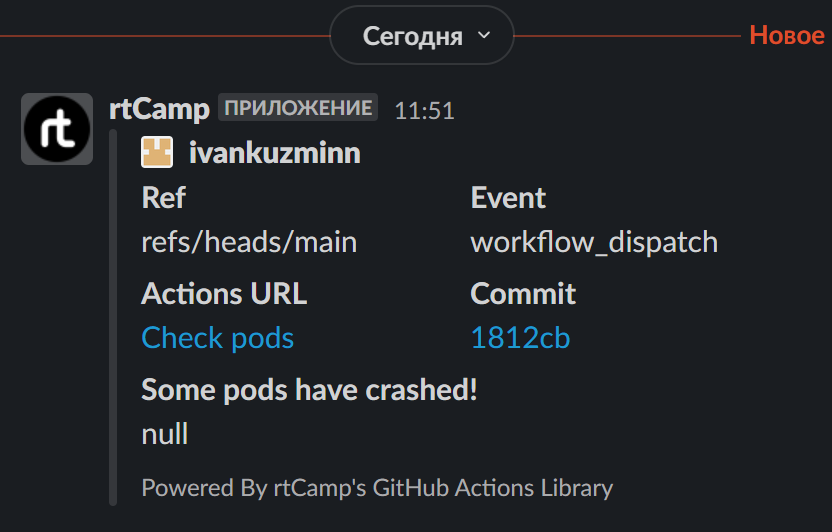

# Homework for 10.K8s.Installation.(WS)

## k9s


## slack



## YAML GithubAction file:
```bash

name: Check pods

on:
  workflow_dispatch

jobs:
    check:
      env:
        output: report.log
        crash_report:
      runs-on: ubuntu-latest
      steps:
      - name: Connect to k3s
        run: |
          mkdir ~/.ssh
          eval `ssh-agent -s`
          ssh-add - <<< "${{ secrets.SSH_KEY }}"
          ssh-keyscan -H ${{ secrets.PROXY_SERVER }} >> ~/.ssh/known_hosts
          ssh ${{ secrets.PROXY_USER }}@${{ secrets.PROXY_SERVER}} ssh-keyscan ${{ secrets.HOST_SERVER }} >> ~/.ssh/known_hosts
          ssh -o ProxyCommand="ssh -W %h:%p ${{ secrets.PROXY_USER }}@${{ secrets.PROXY_SERVER }}" ${{ secrets.HOST_USER }}@${{ secrets.HOST_SERVER }} \
          kubectl get pods -A >> report.log
      - name: check pods
        id: check-pods
        run: |
          echo "pods-failed=$(cat report.log | grep -v Running | wc -l)" >> $GITHUB_OUTPUT
  
      - name: Check crashed pods
        uses: actions/upload-artifact@v3
        with:
          path: report.log
  
      - name: upload crashed pod's list
        if: steps.check-pods.outputs.pods-failed-count > 1
        uses: actions/upload-artifact@v3
        with:
          path: ${{ env.report-file }}

      - name: Slack notify
        uses: rtCamp/action-slack-notify@v2
        if: steps.check-pods.outputs.pods-failed-count != 1
        env:
          SLACK_CHANNEL: slack_git
          SLACK_COLOR: 'red'
          SLACK_ICON: https://github.com/rtCamp.png?size=48
          SLACK_TITLE: 'Some pods have crashed!'
          SLACK_USERNAME: rtCamp
          SLACK_WEBHOOK: ${{ secrets.SLACK_WEBHOOK }}
```