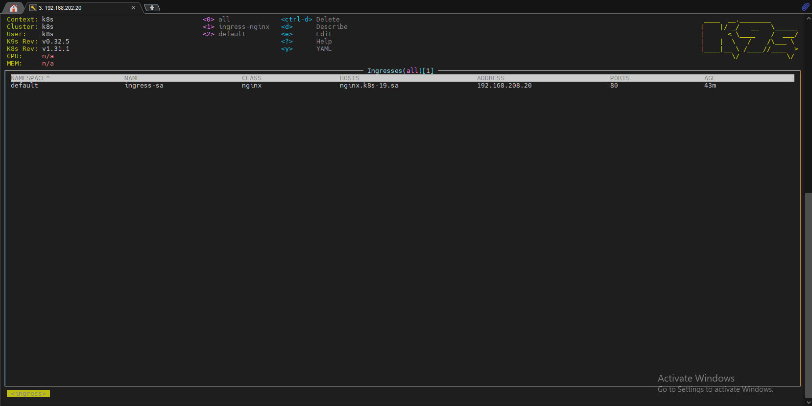
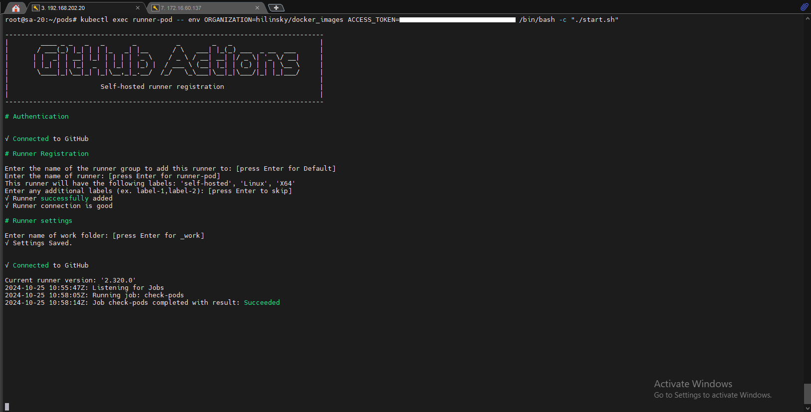
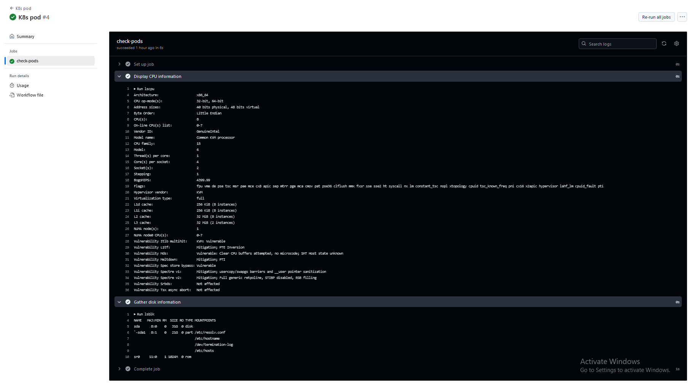

# 11. Kubernetes. Basic objects

## Homework Assignment 1. Nginx deployment

### Create deployment of nginx service:

  * replicas: 4
  * set resources for pods
  * deployment shouldn't have any outage (service is available all time)
  * ingress rule for host name (nginx-test.k8s-<NUMBER>.sa)

    * nginx-deployment.yaml

```yaml
  
  ---
  apiVersion: apps/v1
  kind: Deployment
  metadata:
    name: nginx-deployment
    labels:
      app: nginx
  spec:
    replicas: 4
    strategy:
      type: RollingUpdate
      rollingUpdate:
        maxSurge: 1
        maxUnavailable: 0
    selector:
      matchLabels:
        app: nginx
    template:
      metadata:
        labels:
          app: nginx
      spec:
        containers:
        - name: nginx-container
          image: nginx:latest
          ports:
          - containerPort: 80
          resources:
            requests:
              cpu: 50m
              memory: 50Mi
            limits:
              cpu: 100m
              memory: 100Mi
  ---
  apiVersion: v1
  kind: Service
  metadata:
    name: nginx-service
    labels:
      run: nginx-service
  spec:
    type: LoadBalancer
    ports:
    - port: 80
      protocol: TCP
    selector:
      app: nginx
  ---
  apiVersion: networking.k8s.io/v1
  kind: Ingress
  metadata:
    name: ingress-sa
    annotations:
      nginx.ingress.kubernetes.io/server-alias: "nginx.k8s-20.sa"
  spec:
    ingressClassName: nginx
    rules:
      - host: nginx.k8s-19.sa
        http:
          paths:
            - path: /
              pathType: Prefix
              backend:
                service:
                  name: nginx-service
                  port:
                    number: 80

```

   * Nginx pods:
     
  

   * Nginx ingress:
     
  

   * Curl result:
 
  

## Homework Assignment 2. Self-hosted runner inside k8s (optional)

  * deploy pod inside k8s which should be connected to github as self-hosted runner

    * runner-pod.sh

```sh

  #!/bin/bash
  ## Need to run under regular user with sudo, not root!!!
  RUN_VERSION='2.320.0'
  RUN_REPO='hilinsky/docker_images'
  RUN_TOKEN='XXXXXXXXXXXXXXXXXXXXX'
  sudo apt-get update && sudo apt upgrade -yqq && sudo apt -yqq install curl
  mkdir actions-runner && cd actions-runner
  curl -o actions-runner-linux.tar.gz -L https://github.com/actions/runner/releases/download/v${RUN_VERSION}/actions-runner-linux-x64-${RUN_VERSION}.tar.gz
  tar xzf ./actions-runner-linux.tar.gz
  ./config.sh --name k8s-runner-pod --labels linux,k8s_runner --runnergroup default --url https://github.com/${RUN_REPO} --token ${RUN_TOKEN}
  ./run.sh &

```

  

  * Runner:

    * k8s-pod.yaml

```yaml

  name: K8s pod
  on:
    workflow_dispatch:
  jobs:
    check-pods:
      runs-on: k8s_runner
      steps:
        - name: Display CPU information
          run: |
            lscpu
        - name: Gather disk information
          run: |
            lsblk

```
 
  

   * CPU and Disks information:

  