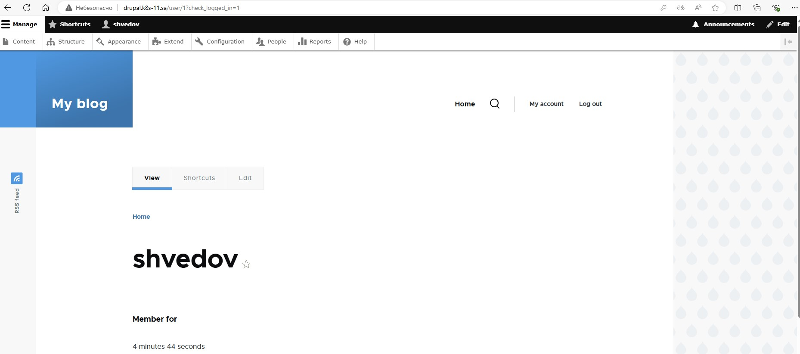

## 13. Kubernetes. Helm

---

## Application deployment by Helm

---


### Install Dynamic Provisioning:


---

```bash
cd .kube/
nano kustomization.yaml
nano nfs-dynamic.yaml
nano patch_nfs_details.yaml
```

- kustomization.yml:

```yml
namespace: nfs-provisioner
bases:
  - github.com/kubernetes-sigs/nfs-subdir-external-provisioner//deploy
resources:
  - nfs-dynamic.yaml
patchesStrategicMerge:
  - patch_nfs_details.yaml
```

- nfs-dynamic.yml:

```yml
apiVersion: v1
kind: Namespace
metadata:
  name: nfs-provisioner
```

- patch_nfs_details.yml:

```yml
apiVersion: apps/v1
kind: Deployment
metadata:
  labels:
    app: nfs-client-provisioner
  name: nfs-client-provisioner
spec:
  template:
    spec:
      containers:
        - name: nfs-client-provisioner
          env:
            - name: NFS_SERVER
              value: 192.168.37.105
            - name: NFS_PATH
              value: /mnt/IT-Academy/nfs-data/sa2-27-24/d_borovskiy
      volumes:
        - name: nfs-client-root
          nfs:
            server: 192.168.37.105
            path: /mnt/IT-Academy/nfs-data/sa2-27-24/d_borovskiy
```

```bash
kubectl apply -k .
```

### Install MariaDB

---

- Install Ansible:

```bash
mkdir Ansible
cd Ansible/
sudo apt update
sudo apt upgrade
sudo apt install python3-pip
sudo pip3 install ansible
```

```bash
nano mariadb.yaml
```

- mariadb.yaml:


```yml
- hosts: mariadb
  vars:
    app_packages:
      - mariadb-server
      - mariadb-client
      - python3-pymysql
      - python3-mysqldb
    db_name: "{{ name_db | default('test') }}"
    db_user: "{{ user_db | default('test') }}"
    db_pass: "{{ pass_db | default('test') }}"
  pre_tasks:
  - name: Validate
    debug:
      msg:
       - "DB name: {{ db_name }}"
       - "DB user: {{ db_user }}"
       - "DB pass: {{ db_pass }}"
  - name: Prepare. Install packages
    apt:
      name: "curl"
      state: latest
      update_cache: yes
    tags: install
  tasks:
  - name: Add MariaDB repos
    shell: |
      curl -LsS -O https://downloads.mariadb.com/MariaDB/mariadb_repo_setup
      bash mariadb_repo_setup --mariadb-server-version=10.6
    tags: install
  - name: MySQL. Install packages
    apt:
      name: "{{ app_packages }}"
      state: latest
    environment:
      DEBIAN_FRONTEND: noninteractive
    tags: install
  - name: MySQL. add bind-address
    ini_file:
      dest: /etc/mysql/my.cnf
      section: mysqld
      option: "bind-address"
      value: "{{ ansible_host }}"

  - name: restart mysql if necessary
    command: service mysql restart

  - name: Test connect
    wait_for:
      host: "{{ ansible_host }}"
      port: 3306
      timeout: 3

  - mysql_db:
      name: "{{ db_name }}"
      state: absent
      login_unix_socket: /var/run/mysqld/mysqld.sock
    tags: never

  - mysql_db:
      name: "{{ db_name }}"
      encoding: utf8
      login_unix_socket: /var/run/mysqld/mysqld.sock

  - mysql_user:
      name: "{{ db_user }}"
      host: "%"
      password: "{{ db_pass }}"
      priv: "{{ db_name }}.*:ALL"
      login_unix_socket: /var/run/mysqld/mysqld.sock
    no_log: yes
```

```bash
nano ansible.cfg
```

- ansible.cfg:

```
[defaults]
# inventory      = /etc/ansible/hosts
# remote_tmp     = /tmp/.ansible/tmp
forks          = 3
host_key_checking = false
callbacks_enabled = profile_tasks, timer
```

```bash
nano inv.yml
```

- inv.yml:

```yaml
db_all:
  hosts:
    mariadb:
      ansible_host: 192.168.202.12
```

```bash
ansible-playbook -i inv.yml mariadb.yml -e name_db=wordpress -e user_db=wordpress -e pass_db=wordpress -l mariadb -u root --ask-pass
```

```bash
ansible-playbook -i inv.yml mariadb.yml -e name_db=drupal -e user_db=drupal -e pass_db=drupal -l mariadb -u root --ask-pass
```

### Install Wordpress

---


```bash
nano pvc_wordpress.yml
```

- pvc_wordpress.yml:

```yml
apiVersion: v1
kind: PersistentVolumeClaim
metadata:
  name: nfs-wordpress
  labels:
    storage.k8s.io/name: nfs
    storage.k8s.io/part-of: kubernetes-complete-reference
spec:
  accessModes:
    - ReadWriteMany
  storageClassName: nfs-client
  resources:
    requests:
      storage: 1Gi
```

```bash
kubectl apply -f pvc_wordpress.yml
```

```bash
helm install wordpress  --set mariadb.enabled=false,externalDatabase.host=192.168.202.12,externalDatabase.password=wordpress,externalDatabase.user=wordpress,externalDatabase.database=wordpress,persistence.existingClaim=nfs-wordpress,wordpressUsername=shvedov,wordpressPassword=wordpress,wordpressFirstName=vitaly,wordpressLastName=shvedov,wordpressBlogName=shvedov,ingress.enabled=true,ingress.hostname=wordpress.k8s-11.sa,ingress.ingressClassName=nginx oci://registry-1.docker.io/bitnamicharts/wordpress
```

### Install Drupal

---

```bash
nano pvc_drupal.yml
```

- pvc_drupal.yml:

```yml
apiVersion: v1
kind: PersistentVolumeClaim
metadata:
  name: nfs-drupal
  labels:
    storage.k8s.io/name: nfs
    storage.k8s.io/part-of: kubernetes-complete-reference
spec:
  accessModes:
    - ReadWriteMany
  storageClassName: nfs-client
  resources:
    requests:
      storage: 1Gi
```

```bash
kubectl apply -f pvc_drupal.yaml
```

```bash
helm install drupal  --set allowEmptyPassword=false,mariadb.enabled=false,externalDatabase.host=192.168.202.12,externalDatabase.password=drupal,externalDatabase.user=drupal,externalDatabase.database=drupal,persistence.existingClaim=nfs-drupal,drupalUsername=shvedov,drupalPassword=shvedov,ingress.enabled=true,ingress.hostname=drupal.k8s-11.sa,ingress.ingressClassName=nginx oci://registry-1.docker.io/bitnamicharts/drupal
```


