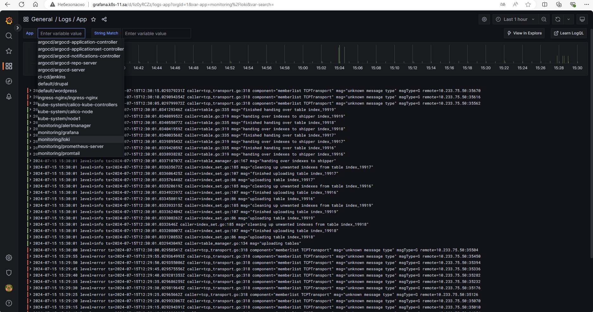
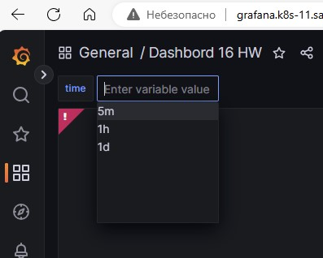

## 17.Log_monitoring.

---

### Use grafana Loki for log monitoring:

---

1. Install Grafana:

```bash
mkdir 17.Log_monitoring
cd 17.Log_monitoring
nano grafana.yaml
```

- grafana.yaml:

```yml
---
apiVersion: v1
kind: ConfigMap
metadata:
  name: grafana-datasources
  namespace: monitoring
data:
  prometheus.yaml: |-
    {
        "apiVersion": 1,
        "datasources": [
            {
               "access":"proxy",
                "editable": true,
                "name": "prometheus",
                "orgId": 1,
                "type": "prometheus",
                "url": "http://prometheus-service:8080",
                "version": 1
            }
        ]
    }
---
apiVersion: apps/v1
kind: Deployment
metadata:
  name: grafana
  namespace: monitoring
spec:
  replicas: 1
  selector:
    matchLabels:
      app: grafana
  template:
    metadata:
      name: grafana
      labels:
        app: grafana
    spec:
      containers:
      - name: grafana
        image: grafana/grafana:9.4.0
        ports:
        - name: grafana
          containerPort: 3000
        resources:
          limits:
            memory: "1Gi"
            cpu: "500m"
          requests:
            memory: "1Gi"
            cpu: "500m"
        volumeMounts:
          - mountPath: /var/lib/grafana
            name: grafana-storage
          - mountPath: /etc/grafana/provisioning/datasources
            name: grafana-datasources
            readOnly: false
      volumes:
        - name: grafana-storage
          emptyDir: {}
        - name: grafana-datasources
          configMap:
              defaultMode: 420
              name: grafana-datasources
---
apiVersion: v1
kind: Service
metadata:
  name: grafana
  namespace: monitoring
  annotations:
      prometheus.io/scrape: 'true'
      prometheus.io/port:   '3000'
spec:
  selector:
    app: grafana
  type: NodePort
  ports:
    - port: 3000
      targetPort: 3000
---
apiVersion: networking.k8s.io/v1
kind: Ingress
metadata:
  name: ingress-grafana
  namespace: monitoring
spec:
  ingressClassName: nginx
  rules:
    - host: grafana.k8s-11.sa
      http:
        paths:
          - path: /
            pathType: Prefix
            backend:
              service:
                name: grafana
                port:
                  number: 3000
```

```bash
kubectl create namespace monitoring
kubectl apply -f grafana.yaml -n monitoring
```


2. Instal loki use ArgoCD and helm repositories [GitHub link](https://grafana.github.io/helm-charts).


3. Create Grafana dashboard:



