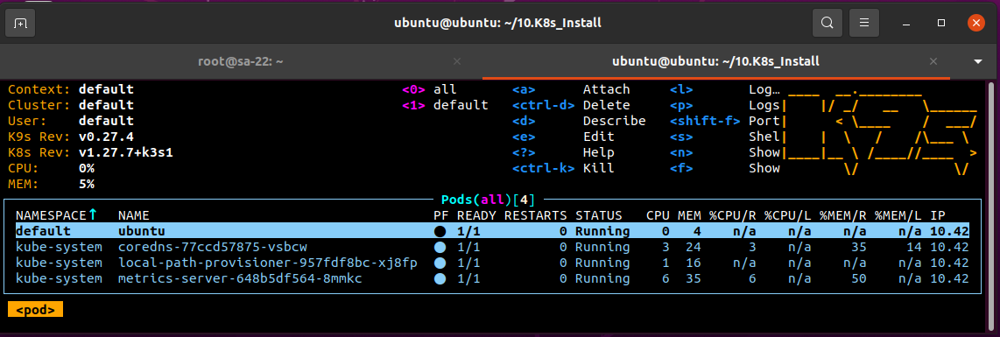

     
     kubernetus node/master 192.168.203.9

```  apt update
     apt install curl
     curl -fL https://get.k3s.io |  sh -s - --write-kubeconfig-mode 644 --disable traefik --disable servicelb
     sudo install -o root -g root -m 0755 kubectl /usr/local/bin/kubectl
     top
     service k3s status
     kubectl get pods -A
```
     Control host (my local VM) to control k8s cluster

```
     curl -fL https://get.k3s.io |  sh -s - --write-kubeconfig-mode 644 --disable traefik --disable servicelb
     sudo install -o root -g root -m 0755 kubectl /usr/local/bin/kubectl
     rm kubectl
     scp root@192.168.203.9:/etc/rancher/k3s/k3s.yaml ~/.kube/config
     scp -o ProxyCommand="ssh -W %h:%p -q jump_sa@178.124.206.53 -p 32510" \
     root@192.168.203.9:/etc/rancher/k3s/k3s.yaml ~/.kube/config
     nano ~/.kube/config
     kubectl get pods -A
     wget https://go.dev/dl/go1.21.3.linux-amd64.tar.gz
     sudo rm -rf /usr/local/go && sudo tar -C /usr/local -xzf go1.21.3.linux-amd64.tar.gz
     nano .profile
     source .profile
     wget https://github.com/derailed/k9s/releases/download/v0.27.4/k9s_Linux_amd64.tar.gz
     cat k9s_Linux_amd64.tar.gz
     sudo tar -C /usr/local/bin/ -xzf k9s_Linux_amd64.tar.gz
     k9s
     nano test.yaml
     kubectl apply -f test.yaml
     k9s
```

```
cat test.yaml
---
apiVersion: v1
kind: Pod
metadata:
  name: ubuntu
  labels:
    app: ubuntu
spec:
  containers:
  - image: ghcr.io/pluhin/busy-box:latest
    command:
      - "sleep"
      - "604800"
    imagePullPolicy: IfNotPresent
    name: ubuntu
  restartPolicy: Always
```


